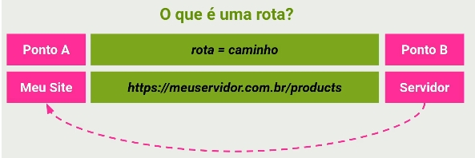
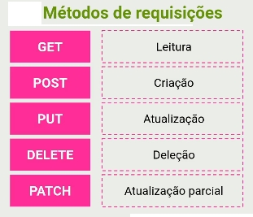
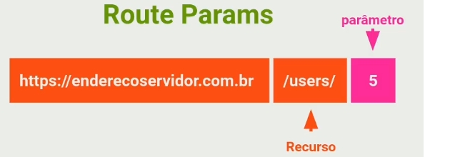
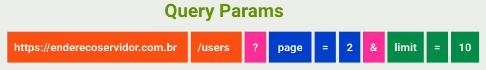
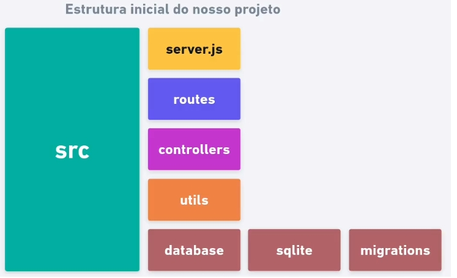

# Criando uma aplicação Node.js

- `npm init -y`
- Iniciando um projeto Nodejs - 04:49: Nessa aula aprenderemos a criar um projeto utilizando o Node.js para já dar início ao nosso primeiro projeto.

- Adicionando o Express - 02:27: Nessa aula aprenderemos como instalar o Express em nosso projeto, o Express é um framework utilizado para lidar com requisições HTTP.
  - O [Express](https://expressjs.com/pt-br/) é um framework para aplicativo da web do Node.js mínimo e flexível que fornece um conjunto robusto de recursos para aplicativos web e móvel.
  - Instalação: `npm install express --save` (instalar como dependência de produção)
- node_modules - 05:12: Nessa aula entenderemos para que serve a pasta `node_modules` o que tem dentro dela e como evitar para que ela seja enviada para um repositório na nuvem.
- Utilizando o Express - 04:55: ssa aula aprenderemos como fazer as configurações iniciais do Express em nosso projeto.
  - node src/server.js
  - Usar o script: npm start
- Executando a aplicação - 03:13: Nessa aula executaremos o Express em nosso projeto e como automatizar a execução do Express.
- Rotas e Métodos HTTP - 05:14: Nessa aula aprenderemos o que são e como funciona as Rotas e os métodos de requisição (GET, POST, PUT, DELETE, PATCH)

- Método GET - 05:59: Nessa aula utilizaremos em nossa API o método GET para exibir uma mensagem no navegador ao acessar a rota.

- Route Params - 09:59: Nessa aula aprenderemos como utilizar os Route Params utilizando recursos e parâmetros em nossa Rota.

- Query Params - 08:23: Nessa aula aprenderemos o que é Query Params e como utilizar e qual a diferença dele para o Route Params
  - `http://localhost:3000/users?page=5&limit=10`

- Nodemon - 07:49:Nessa aula instalaremos uma dependência de desenvolvimento chamada Nodemon. Dessa forma, não precisaremos ficar reiniciando o nosso servidor manualmente sempre que houver uma alteração.

  - `npm install nodemon --save-dev` (instalar como dependência de desenvolvimento)
  - Rodar com o dev: `npm run dev`

- Insomnia - 02:48: Nessa aula aprenderemos como utilizar outras rotas dentro do nosso projeto utilizando a ferramenta Insomnia.

  - Comece a criar, projetar e testar APIs melhores por meio do desenvolvimento de primeira especificação orientado por pipelines APIOps CI/CD: [Insomnia](https://insomnia.rest/download)

- Método POST - 02:27: Nessa aula aprenderemos como utilizar o método POST dentro do Insomnia

- Body Params - 04:57: Nessa aula aprenderemos como enviar e receber dados utilizando o body da nossa requisição no formato JSON.

- Organizando a estrutura do projeto - 10:48: Nessa aula aprenderemos a melhor maneira de organizar a estrutura do nosso projeto. Imagem de exemplo de como será a estrutura daqui pra frente:

  
  - Criar pastas dendro de src/
    - routes / users.routes.js; index.js
    - controllers
    - utils
    - database / sqlite / migrations

- Controllers - 06:08
- Users Controller - 04:08
- HTTP Codes - 04:35
- Entendendo Middlewares - 05:35
- Utilizando Middlewares - 09:49
- App Error - 03:50
- Tratando exceções - 09:06
- Configurando o Insomnia - 05:25
